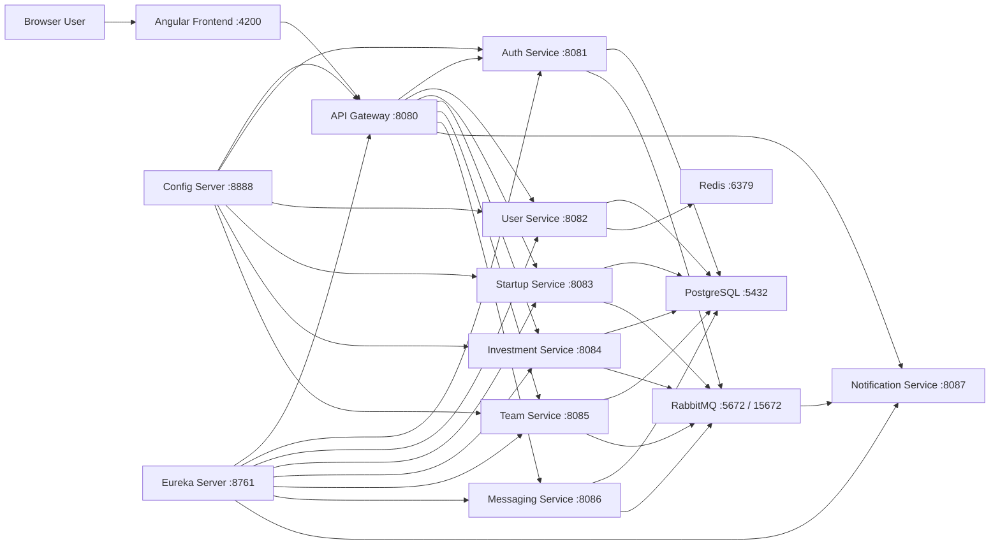

# FounderLink

FounderLink is a full-stack microservices platform that connects startup founders, investors, co-founders, and admins. Founders can publish startups, investors can discover and invest in them, co-founders can join teams, users can message each other, and notification events are sent through an asynchronous email flow.

The project is built with an Angular frontend, Spring Boot backend microservices, Docker Compose for local orchestration, SonarQube for code quality and coverage, and GitHub Actions for CI/CD.

## Developer Skills Demonstrated

This project is designed to show end-to-end software engineering ability across frontend, backend, databases, problem solving, testing, DevOps, and code quality.

| Area | What this project demonstrates |
| --- | --- |
| Frontend Development | Angular 20, TypeScript, routing, forms, role-based dashboards, reusable service pages, state management with signals, API integration with `HttpClient` |
| Backend Development | Java 17, Spring Boot REST APIs, microservices, service-to-service communication, JWT security, validation, exception handling, layered architecture |
| Microservices Architecture | API Gateway, Config Server, Eureka discovery, independent service boundaries, Dockerized services, asynchronous event flow |
| Databases | PostgreSQL relational modeling for users, startups, investments, teams, conversations, and messages |
| Caching | Redis caching in `user-service` for faster profile access |
| Messaging Systems | RabbitMQ event publishing and consuming for non-blocking notification workflows |
| DevOps | Docker Compose, multi-container local environment, service health checks, environment-based configuration |
| CI/CD | GitHub Actions matrix builds, backend verification, frontend build/test pipeline, Docker Compose validation, deploy workflow |
| Code Quality | SonarQube, JaCoCo, LCOV, quality gates, separate service coverage, test coverage improvements |
| Testing | JUnit 5, Mockito, Spring Boot tests, Angular Karma/Jasmine tests, controller and service-level test coverage |
| Programming Fundamentals | Object-oriented design, DTO mapping, authentication flow design, REST API design, error handling, collection transformations, filtering, sorting, role-based access rules |
| DSA and Problem Solving | Uses maps, sets, lists, filtering, search, role matching, status transitions, conversation grouping, dashboard aggregation, queue-based event handling, and optimized lookup patterns |

## Technical Skill Map

### Frontend

- Built a single-page application using Angular and TypeScript.
- Implemented route guards for authenticated and guest-only routes.
- Created role-aware dashboard navigation for founders, investors, co-founders, and admins.
- Integrated the UI with backend APIs through the API Gateway.
- Managed local state, backend refresh, session persistence, and computed dashboard data.
- Used Angular forms for login, registration, OTP verification, startup creation, investments, teams, and messaging.

### Backend

- Built multiple Spring Boot services with clear responsibility boundaries.
- Implemented REST APIs for auth, users, startups, investments, teams, messaging, and notifications.
- Added JWT-based security and role-aware behavior.
- Used OpenFeign for service-to-service communication.
- Used RabbitMQ to decouple notification delivery from business logic.
- Used PostgreSQL with Spring Data JPA for persistent storage.
- Added Redis caching for frequently accessed user profile data.

### DSA and Programming Concepts

- Used `Map` structures for role lookup and fast user-role access.
- Used `Set` structures to avoid duplicate startup or conversation aggregation.
- Used list filtering and sorting for dashboards, startup discovery, messages, investments, and notifications.
- Implemented status transition logic for startup review and investment lifecycle.
- Implemented conversation grouping and partner resolution for messaging.
- Used queue-based asynchronous processing with RabbitMQ.
- Applied object-oriented programming with controllers, services, repositories, DTOs, entities, clients, and producers.
- Applied validation, exception handling, and clean separation of concerns.

### Database and System Design

- Designed relational persistence around users, roles, profiles, startups, investments, teams, conversations, and messages.
- Used PostgreSQL for structured transactional data.
- Used Redis where low-latency cached reads make sense.
- Used RabbitMQ for eventual notification delivery.
- Used Docker Compose to run the system as a realistic distributed environment.

## Project Goals

- Provide a role-based platform for founders, investors, co-founders, and admins.
- Keep backend features split into focused microservices.
- Use service discovery and an API gateway so the frontend has one main backend entry point.
- Use asynchronous messaging for notifications so user-facing operations are not blocked by email delivery.
- Maintain quality using unit tests, JaCoCo coverage, SonarQube scans, and CI validation.
- Run the complete stack locally with Docker Compose.

## High-Level Architecture



## Main User Workflow

1. A user opens the Angular app at `http://localhost:4200`.
2. The frontend communicates with the backend through the API Gateway at `http://localhost:8080`.
3. New users register through `auth-service`.
4. `auth-service` creates authentication data, sends OTP notifications, and syncs profile data into `user-service`.
5. Users verify OTP and then log in with a JWT token.
6. The frontend stores the session and sends the JWT in the `Authorization` header for protected operations.
7. Founders create startup listings through `startup-service`.
8. Admins review startup status.
9. Investors discover approved startups and create investment requests through `investment-service`.
10. Founders approve, reject, or complete investments.
11. Founders invite co-founders through `team-service`.
12. Users create conversations and send messages through `messaging-service`.
13. Notification events are published to RabbitMQ and handled by `notification-service`.
14. SonarQube scans test and coverage reports to show quality and coverage per service.

## Repository Structure

```text
FounderLink/
  api-gateway/                 Spring Cloud Gateway entry point
  auth-service/                Registration, login, OTP, JWT, roles
  config-server/               Centralized service configuration
  eureka-server/               Service discovery registry
  user-service/                User profile and directory service
  startup-service/             Startup listing and review workflow
  investment-service/          Investment request and status workflow
  team-service/                Team invitation and join workflow
  messaging-service/           Conversations and messages
  notification-service/        Email notification consumer
  sprint frontend/founderlink/ Angular frontend
  .github/workflows/ci-cd.yml  GitHub Actions CI/CD workflow
  docker-compose.yml           Full local stack
  SONAR.md                     SonarQube setup notes
```

## Backend Services

### API Gateway

Path: `api-gateway`

What it does:
- Provides the single backend entry point for the Angular frontend.
- Routes requests to backend services using paths such as `/auth/**`, `/users/**`, `/startups/**`, `/investments/**`, `/teams/**`, `/messages/**`, and `/notifications/**`.
- Aggregates Swagger/OpenAPI docs from services under `/aggregate/...`.
- Handles CORS for frontend access.

Why we use it:
- The frontend should not need to know every service URL.
- It keeps routing centralized.
- It makes the architecture easier to scale because services can move behind the gateway.

When it is used:
- Every frontend request goes through the gateway during normal app usage.

Tech used:
- Spring Cloud Gateway for routing.
- Springdoc WebFlux UI for gateway Swagger aggregation.
- Eureka client for service discovery support.

### Auth Service

Path: `auth-service`

What it does:
- Handles user registration.
- Generates and verifies OTP codes.
- Handles login and JWT generation.
- Handles password reset flow.
- Stores user authentication records and roles.
- Syncs basic profile data to `user-service`.
- Publishes notification events for OTP and password reset emails.

Why we use it:
- Authentication is a security-sensitive concern, so it is kept separate from profile and business services.
- JWT allows stateless authentication across services.
- OTP verification improves account trust.

When it is used:
- During registration, OTP verification, login, password reset, and role lookup.

Tech used:
- Spring Boot Web for REST APIs.
- Spring Security for password encoding and auth rules.
- JJWT for JWT token generation and validation.
- Spring Data JPA with PostgreSQL for user and role persistence.
- OpenFeign to sync profile data to `user-service`.
- RabbitMQ through Spring AMQP for notification events.

### User Service

Path: `user-service`

What it does:
- Stores user profile information.
- Exposes user directory data.
- Provides internal endpoints for other services to fetch user summaries.
- Syncs profile data from auth registration.
- Uses Redis caching for profile reads.

Why we use it:
- Authentication data and profile data are different responsibilities.
- Other services need user profile summaries without depending on auth internals.
- Redis improves repeated profile lookup performance.

When it is used:
- After registration profile sync.
- When dashboards load user directory data.
- When investment, team, or messaging services need user names and emails.

Tech used:
- Spring Boot Web.
- Spring Data JPA with PostgreSQL.
- Spring Cache with Redis.
- Spring Security and JWT filter support.
- Springdoc for API docs.

### Startup Service

Path: `startup-service`

What it does:
- Lets founders create startup listings.
- Lets users browse startups.
- Lets admins review or update startup status.
- Stores startup details such as title, domain, problem, solution, funding goal, stage, location, pitch, and team roles.
- Sends notification events when startup status changes.

Why we use it:
- Startup listing is the central business object in FounderLink.
- Keeping it separate makes review, discovery, and startup lifecycle rules easier to maintain.

When it is used:
- When a founder creates or updates a startup.
- When investors and co-founders browse startups.
- When admins approve or reject startups.

Tech used:
- Spring Boot Web.
- Spring Data JPA with PostgreSQL.
- Spring Security and JWT filter support.
- OpenFeign for user lookup.
- RabbitMQ for startup notification events.

### Investment Service

Path: `investment-service`

What it does:
- Allows investors to create investment requests.
- Allows users to list investments by startup or investor.
- Allows status updates such as `PENDING`, `APPROVED`, `REJECTED`, and `COMPLETED`.
- Notifies founders when a new investment request is created.

Why we use it:
- Investment lifecycle is separate from startup listing.
- Founders and investors need a clear workflow around request, approval, and completion.

When it is used:
- When an investor invests in a startup.
- When founders review investment requests.
- When dashboards show portfolio or startup investment queues.

Tech used:
- Spring Boot Web.
- Spring Data JPA with PostgreSQL.
- Spring Security and JWT filter support.
- OpenFeign for startup and user lookup.
- RabbitMQ for notification events.

### Team Service

Path: `team-service`

What it does:
- Allows founders/admins to invite users to a startup team.
- Allows invited users to accept team invitations.
- Lists team members by startup.
- Lists current user's active teams.
- Sends notification events for invites and joins.

Why we use it:
- Team membership has its own lifecycle and access rules.
- It connects founders with co-founders without mixing the logic into startup management.

When it is used:
- When founders invite co-founders.
- When co-founders join a startup team.
- When dashboards show team status.

Tech used:
- Spring Boot Web.
- Spring Data JPA with PostgreSQL.
- Spring Security and JWT filter support.
- OpenFeign for user lookup.
- RabbitMQ for team notifications.

### Messaging Service

Path: `messaging-service`

What it does:
- Creates conversations between users.
- Stores and retrieves messages.
- Ensures authenticated users can only access their own conversations.
- Sends notification events when messages are sent.

Why we use it:
- Messaging is a real-time collaboration concern and should not be mixed with startup or investment logic.
- It lets founders, investors, and co-founders communicate inside the platform.

When it is used:
- When users open the messaging service page.
- When a founder, investor, or co-founder starts a conversation.
- When messages are sent or refreshed.

Tech used:
- Spring Boot Web.
- Spring Data JPA with PostgreSQL.
- Spring Security and JWT filter support.
- OpenFeign for user lookup.
- RabbitMQ for message notification events.

### Notification Service

Path: `notification-service`

What it does:
- Consumes notification events from RabbitMQ.
- Sends email notifications.
- Exposes a status endpoint for checking notification-service health.

Why we use it:
- Email delivery should not block registration, investment, team, or messaging workflows.
- RabbitMQ allows event producers to continue even if email delivery is temporarily slow.

When it is used:
- OTP emails.
- Password reset emails.
- Startup updates.
- Investment notifications.
- Team invite notifications.
- Message notifications.

Tech used:
- Spring Boot Web.
- Spring Mail.
- Spring AMQP with RabbitMQ.
- Eureka client.

### Config Server

Path: `config-server`

What it does:
- Provides centralized configuration for services.
- Stores service config files under `config-server/src/main/resources/config`.

Why we use it:
- Microservices need consistent environment-driven configuration.
- Centralized config avoids duplicating the same routing, database, and discovery settings everywhere.

When it is used:
- During service startup.
- When services need config values such as ports, service URLs, and discovery settings.

Tech used:
- Spring Cloud Config Server.
- Spring Boot Actuator.

### Eureka Server

Path: `eureka-server`

What it does:
- Provides service discovery.
- Lets services register themselves and discover each other.

Why we use it:
- Microservices should not rely only on hardcoded service locations.
- Service discovery is useful when services are scaled, restarted, or moved.

When it is used:
- During service startup and runtime service registration.

Tech used:
- Spring Cloud Netflix Eureka Server.
- Spring Boot Actuator.

## Frontend

Path: `sprint frontend/founderlink`

What it does:
- Provides the user interface for registration, login, OTP verification, dashboards, service pages, startup discovery, investments, teams, messages, and notifications.
- Uses role-based routes and role-based service access.
- Stores session data in browser local storage.
- Sends requests to the API Gateway at `http://localhost:8080`.

Main routes:

```text
/auth
/dashboard
/services/:service
```

Why Angular was chosen:
- Angular provides a structured framework for large forms, role-based dashboards, routing, stateful UI, and service pages.
- TypeScript gives stronger typing for frontend data models.
- Angular CLI provides standard build, test, and production workflows.
- Signals and computed state fit the dashboard style of the app.

Frontend tech:
- Angular 20.
- TypeScript.
- Angular Router.
- Angular Forms.
- Angular HttpClient.
- Karma/Jasmine for tests.
- Nginx for Docker production serving.

## Data and Infrastructure

### PostgreSQL

Used by:
- `auth-service`
- `user-service`
- `startup-service`
- `investment-service`
- `team-service`
- `messaging-service`

Why:
- Relational data fits users, roles, startups, teams, investments, conversations, and messages.
- PostgreSQL is reliable, widely used, and Docker-friendly.

### Redis

Used by:
- `user-service`

Why:
- Caches user profile reads.
- Reduces repeated database calls for frequently accessed profile data.

### RabbitMQ

Used by:
- Auth, startup, investment, team, and messaging services as producers.
- Notification service as a consumer.

Why:
- Decouples notification sending from business workflows.
- Improves reliability because producers do not need email delivery to succeed immediately.
- RabbitMQ management UI is available at `http://localhost:15672`.

## Why These Technologies

| Technology | Why it was chosen |
| --- | --- |
| Spring Boot | Fast REST API development, strong ecosystem, production-ready defaults |
| Spring Cloud Gateway | Central API entry point and route management |
| Spring Cloud Config | Centralized microservice configuration |
| Eureka | Service discovery for distributed services |
| Spring Security | Authentication and authorization foundation |
| JWT | Stateless authentication across services |
| Spring Data JPA | Cleaner persistence layer over PostgreSQL |
| PostgreSQL | Reliable relational database for structured domain data |
| Redis | Fast cache for user profile lookups |
| RabbitMQ | Asynchronous event-driven notifications |
| OpenFeign | Simple service-to-service HTTP clients |
| Angular | Structured SPA framework with routing, forms, and TypeScript |
| Nginx | Lightweight production server for compiled Angular assets |
| Docker Compose | One command local environment for all services |
| SonarQube | Code quality, bugs, smells, quality gates, and coverage visibility |
| GitHub Actions | Automated backend tests, frontend tests, Docker build validation, and deploy hook |

## Docker Workflow

Start the full application stack:

```bat
docker compose up -d --build
```

Useful URLs:

```text
Frontend:        http://localhost:4200
API Gateway:     http://localhost:8080
Swagger UI:      http://localhost:8080/swagger-ui.html
Eureka:          http://localhost:8761
RabbitMQ UI:     http://localhost:15672
PostgreSQL:      localhost:5432
Redis:           localhost:6379
```

Start only SonarQube:

```bat
docker compose --profile sonar up -d sonarqube-db sonarqube
```

SonarQube runs at:

```text
http://localhost:9000
```

Stop containers:

```bat
docker compose down
```

Stop containers and remove volumes:

```bat
docker compose down -v
```

## Local Development Workflow

Build and test all backend services and frontend coverage:

```bat
build-all-for-sonar.bat
```

Run a single backend service test suite:

```bat
mvn -f auth-service\pom.xml verify
```

Run frontend locally:

```bat
cd "sprint frontend\founderlink"
npm ci
npm start
```

Run frontend tests with coverage:

```bat
cd "sprint frontend\founderlink"
npm run test:ci
```

## SonarQube Workflow

SonarQube is used to track:

- Bugs
- Vulnerabilities
- Security hotspots
- Code smells
- Test coverage
- Duplications
- Quality gate status

Start SonarQube:

```bat
docker compose --profile sonar up -d sonarqube-db sonarqube
```

Build coverage reports:

```bat
build-all-for-sonar.bat
```

Scan each service as a separate SonarQube project:

```bat
run-sonar-separate-docker.bat http://host.docker.internal:9000 YOUR_SONAR_TOKEN FounderLink
```

Separate Sonar projects are useful because each service gets its own coverage and quality gate instead of hiding everything inside one large `FounderLink` project.

The separate scan excludes boilerplate package folders such as DTOs, entities, repositories, configuration, security filters, clients, producers, and exception handlers from coverage. SonarQube still analyzes those files for issues, but the coverage percentage focuses on tested business behavior.

## CI/CD Workflow

GitHub Actions workflow:

```text
.github/workflows/ci-cd.yml
```

It runs on:

- Push to `main`, `master`, or `develop`
- Pull requests to `main`, `master`, or `develop`
- Manual workflow dispatch

Jobs:

1. `backend-tests`
   - Runs as a matrix over all backend services.
   - Uses Java 17.
   - Starts PostgreSQL, Redis, and RabbitMQ service containers.
   - Runs `mvn -B verify` for each service.
   - Uploads JaCoCo XML reports as workflow artifacts.

2. `frontend-build`
   - Uses Node.js 20.
   - Runs `npm ci`.
   - Runs Angular tests with coverage.
   - Builds the Angular app.
   - Uploads LCOV coverage as an artifact.

3. `docker-build`
   - Runs after backend and frontend jobs pass.
   - Validates Docker Compose configuration.
   - Builds all Docker images.

4. `deploy`
   - Runs only on pushes to `main`.
   - Requires repository variable `ENABLE_DEPLOY=true`.
   - Uses SSH secrets to pull the latest code and run `docker compose up -d --build` on the server.

Why CI/CD is used:
- Prevents broken services from entering main branches.
- Confirms backend, frontend, and Docker builds in a clean environment.
- Keeps deployment repeatable.

## Quality and Coverage

Backend coverage is generated with:

```text
JaCoCo XML: each-service/target/site/jacoco/jacoco.xml
```

Frontend coverage is generated with:

```text
sprint frontend/founderlink/coverage/founderlink/lcov.info
```

Quality target:

- Coverage on new code: at least 80 percent.
- Reliability rating: A.
- Security rating: A.
- Maintainability rating: A.

## Common Commands

Full Docker build and run:

```bat
docker compose up -d --build
```

Build all tests and coverage:

```bat
build-all-for-sonar.bat
```

Run separate SonarQube scan:

```bat
run-sonar-separate-docker.bat http://host.docker.internal:9000 YOUR_SONAR_TOKEN FounderLink
```

Run one service:

```bat
mvn -f user-service\pom.xml spring-boot:run
```

Run one service tests:

```bat
mvn -f user-service\pom.xml verify
```

Frontend install, test, and build:

```bat
cd "sprint frontend\founderlink"
npm ci
npm run test:ci
npm run build
```

## Summary

FounderLink uses a microservices architecture because the platform has separate business areas: auth, profiles, startup listings, investments, teams, messaging, and notifications. Spring Boot and Spring Cloud provide the backend foundation, Angular provides the frontend application, Docker Compose makes the system runnable locally, SonarQube keeps quality visible, and GitHub Actions validates every service and build workflow before deployment.
